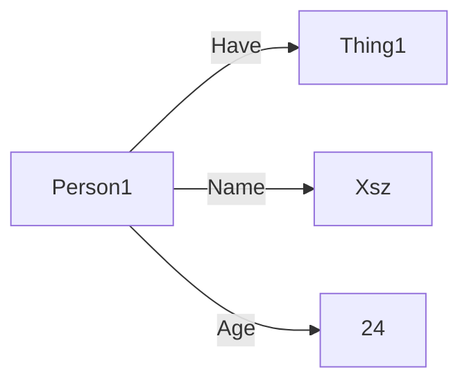

## 材料知识图谱

---

> 知识图谱是⼀种⽤图模型来描述知识和建模世界万物之间的关联关系的技术方法

既然其是对现实世界模型的构建，那么在材料领域当然要构建材料的现实模型，知识图谱在材料领域，应当像计算仿真一样，“从头算起”，那么就要从原子级别建立起宏伟的材料知识图谱。

##### 知识图谱构建几个问题：
- 可信度问题，或者说真理问题
- 重复性问题，或者说唯一问题
- 完备性问题，或者说全面问题

知识图谱分为两种搭建方式，一个是RDF图，另一个是属性图，RDF图节点与关系不具有储存属性的能力，如图1

Person1不具有其属性的储存功能，每个属性都需要进行关系的连接,如Person1的名字和年龄。所以不得不引入具体化技术以使关系具有意义。

而属性图则大为不同，每个节点和每个关系都可以进行属性的储存，使其具有强大的数据储存功能，也就是Neo4j的构建方法。

#####  知识图谱的储存和查询

Neo4j
AgensGraph
Memgraph
图数据的储存进化过程，和数据储存结构化高度相似[见知识图谱构建技术第三章]

##### 材料知识图谱储存
经过[材料基因工程数据库](https://www.mgedata.cn/) 的探索，本人在[[知识图谱之本体论]]中提出的[[材料数据模型]]的概念是可行的
###### WEB3.0
用户创建，用户管理，用户使用
MGE系统具有一定的[[WEB3.0]]性质