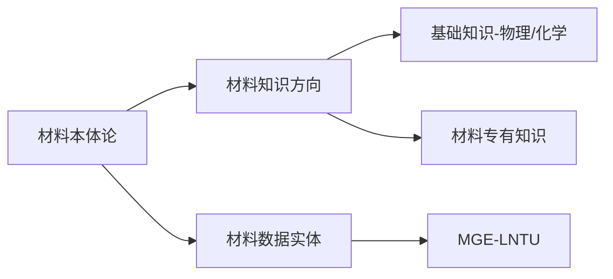

## 本体论
---- 
#本体论基础 #知识图谱之本体论

>*Ontology 探究世界的本原或基质的哲学*

研究知识图谱不得不提到的哲学思想就是本体论，其代表世界本源的信息标识，每个个体都有独立的标识，个体之间依据现实世界的真实关系进行关系网构建，以用可储存的信息对真实世界进行建模。 ^042c36

</br>
在材料科学与现代信息科学相结合的领域，本体论涵盖了两大领域， 材料知识 与 材料数据实体
</br>


展开来说，对于材料知识方向，既建立基本的物理化学现阶段知识，又在基础知识的基础上建立材料方向的专有知识，拿焊接知识来说，焊接热源对焊接热影响区的影响既建立在热力学知识之上，又建立在晶体学知识基础上，两类关系构成了焊接热影响区的知识。
对于材料数据实体，就不得不提到更加高层次的概念，***材料数据模型***，这是来自于面对对象模型(OOP)的概念，又有所不同。
</br>
- 材料数据模型  ——  *不同材料标识下的数据结构*

OPP模型是计算机领域最棒的结构指导思想，对于OOP的借鉴在材料数据建设这一新生的领域是非常具有价值的。简而言之，材料数据模型的概念就是在不同材料数据系列的标识下建立的有关数据分类，数据分类下字段的模型。如下是基本的JAVA类，其具有元素序号，颜色等字段属性，我们可以视为其是铁元素的类写法，但是对于铁元素为主的一些材料，因为其性能等属性，决定其用于不同领域，那么，不同标识下的材料必定会产生部分不相同的数据，所以，在OPP的基础上，增加数据分类这一中间层，便于数据的采集和检索。

```java
class Fe:
	ElementNumber int;
	Color String;
	·······
```
如下：
```js
MaterClass FeO_2 {
# ` _ `代表下标，这是一种标识写法
	DataSort SourceInfomation {
		SortType Academic_Paper {
			TypeFeild Author
			TypeFeild DOI
			TypeFeild Date
		}
	}

	DataSort CharacterInformation {
		SortType XRD {
			TypeFeild Unit_Type
			·······
		}
	}

	·······
}
```

这是现阶段MGE工程下的数据模型结构，对于$FeO_2$特有的数据结构，从DataSort和其下的SortType进行特征性的构建。每种材料根据标识和功能进行标识，构成在MGE系统中的本体模型，其采集工作就是添加其本体模型下的实体，构成知识图谱。

---

## 标识的确定
##### 材料名称标识
材料化学式简写和材料数据领域简写连拼，例子如下：
$$ 1 .FeO_2-Weld$$
$$ 2 .NCM$$
1式简写代表Feo在焊接领域得到的数据模型简写，材料数据标识同时是材料数据模型的名称。
##### 材料数据个体标识
MaterID被简化为M_ID储存在Neo4j中，在M_ID之上，有材料名称标识进行限定，每个材料标识下的M_ID应当是唯一的，进行材料数据个体标识。